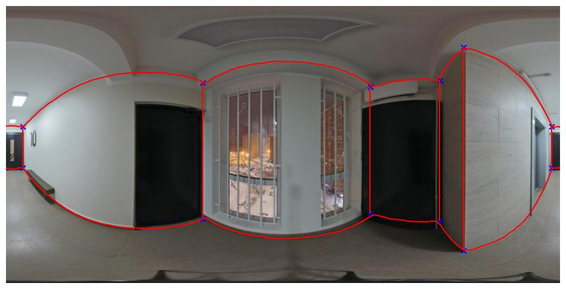

# Проецирование панорамного снимка на плоскости 3D-модели
## Исходные данные
1. [Панорамный снимок помещения](data/image_1024_aligned_rgb.png) (в виде равнопромежуточной цилиндрической проекции).
2. [Двумерный план этого помещения](data/floor_plan_test.jpg).
3. [Файл json](data/test_object_lu.json), содержащий список стен помещения с индексами от 0 до 5. Для каждой стены указан список из 2 координат стены на двумерном плане [x1, y1, x3, y3]. x1, y1 соответствуют координатам левого-верхнего края стены, x3, y3 – правого-нижнего. Начало координат соответствует самой верхней-левой точке плана.
4. [Список координат вертикальных углов между стенами](data/v_corners.npy) в помещении в виде сохраненного numpy.array размера (12, 2). Нечетные строки массива - верхние точки углов, четные - нижние. Первый столбец - x, второй - y.
5. [Список координат y горизонтальных углов](data/h_corners.npy) помещения для каждого x из интервала [0, 1023] в виде сохраненного numpy.array размера (2, 1024). Первая строка содержит y угла между стенами и потолком для каждого x, вторая строка – y угла между стенами и полом.
6. [Карта глубины](data/depth_map.npy) снимка в виде сохраненного numpy.array.  

Если все углы нанести на снимок, он будет разделен на 8 сегментов, соответствующих полу, потолку и 6 стенам (в средней части справа и слева компоненты одного сегмента).

***
## Задача 1
Необходимо написать алгоритм, создающий 8 перспективных 2D-проекций из 8 частей панорамного снимка, соответствующих полу, потолку и 6 стенам из плана помещения. Все проекции должны иметь одинаковый масштаб, т.е. 1 пиксель всех проекций должен соответствовать одному и тому же реальному физическому размеру.
Высоту потолка принять за 2.5 метра.
### Input
Любая комбинация исходных данных.
### Output 
8 файлов изображений с проекциями с именами ceil_proj.jpg, floor_proj.jpg, 0_proj.jpg, 1_proj.jpg и т.д.
### Результат решения
Cсылка на архив с jupyter notebook и 8 изображениями на файлообменном сервисе. Просьба не делать git pull в репозиторий задачи.
***
## Задача 2 (дополнительная, необязательная)
Создать структуру данных room, содержащую:
- геометрическое 3D-описание всех поверхностей помещения (пола, потолка, стен);
- описание их взаимного положения/связей;
- проекции панорамного снимка на все эти поверхности (из Задачи 1).  
Вывести эту структуру в виде json-файла.  
Создать простое средство 3D-просмотра модели помещения, соответствующей структуре room (поверхности должны быть текстурированы проекциями панорамного снимка).  
### Результат решения
Cсылка на архив с jupyter notebook и 8 изображениями на файлообменном сервисе. Просьба не делать git pull в репозиторий задачи.  
***
Код должен быть написан на ЯП Python 3 в jupyter notebook.
